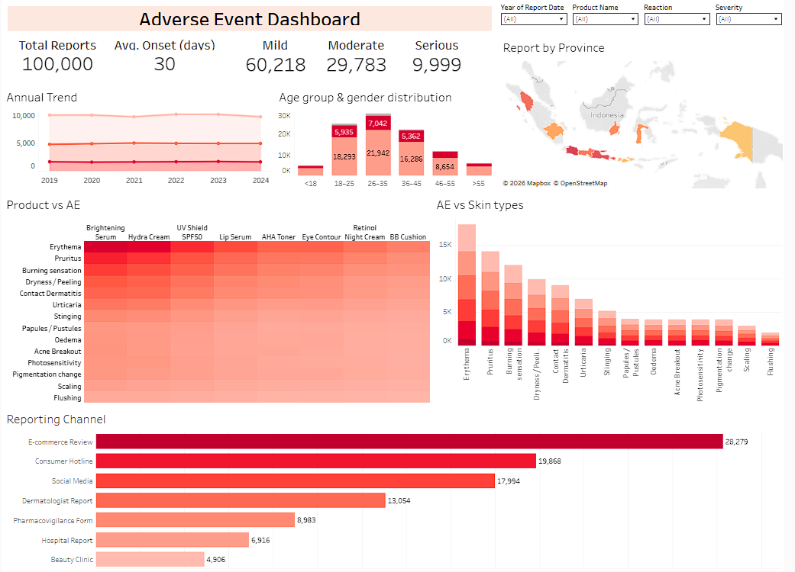

## Tableau Dashboard 
https://public.tableau.com/views/AdverseEventDashboard/Dashboard1?:language=en-GB&:sid=&:redirect=auth&:display_count=n&:origin=viz_share_link

# Adverse Event Dashboard

This project presents an interactive **Adverse Event Dashboard** built using Tableau to explore patterns, trends, and insights related to adverse events in cosmetic products.

## Overview
The dashboard is designed to support data exploration across multiple dimensions such as product type, adverse event category, severity, demographics, and time-to-onset. It enables users to identify potential safety signals and better understand reporting trends through interactive visualizations.

## Dataset
The dataset used in this project consists of **100,000 rows**, providing a sufficiently large sample to simulate real-world analysis scenarios. The data includes variables such as:
- Product Name
- Adverse Event (AE)
- Severity Level
- Demographics (e.g., gender, age group)
- Time to Onset
- Report Date

## Key Features
- **Interactive Filters** for dynamic data exploration  
- **Region Analysis** to compare adverse events across different locations  
- **KPI Summary** highlighting key metrics at a glance  
- **Yearly Adverse Event Trend** to monitor changes over time  
- **Demographic Breakdown** (e.g., gender, age group)  
- **Product vs Adverse Event Analysis** to identify product-related patterns  
- **Adverse Event vs Skin Types** analysis for targeted insights  
- **Reporting Channel Distribution** to understand source of reports  

## Disclaimer
The dataset used in this project is **synthetically generated using AI** and is intended solely for educational and portfolio purposes.  

- No real company data has been used  
- Product names do **not** represent or refer to any actual brands  
- Any similarities to real products, companies, or events are purely coincidental  
- The analysis does not reflect real-world safety data or regulatory findings  

## Tools Used
- Claude (generate data)
- Excel
- Tableau

## Preview

